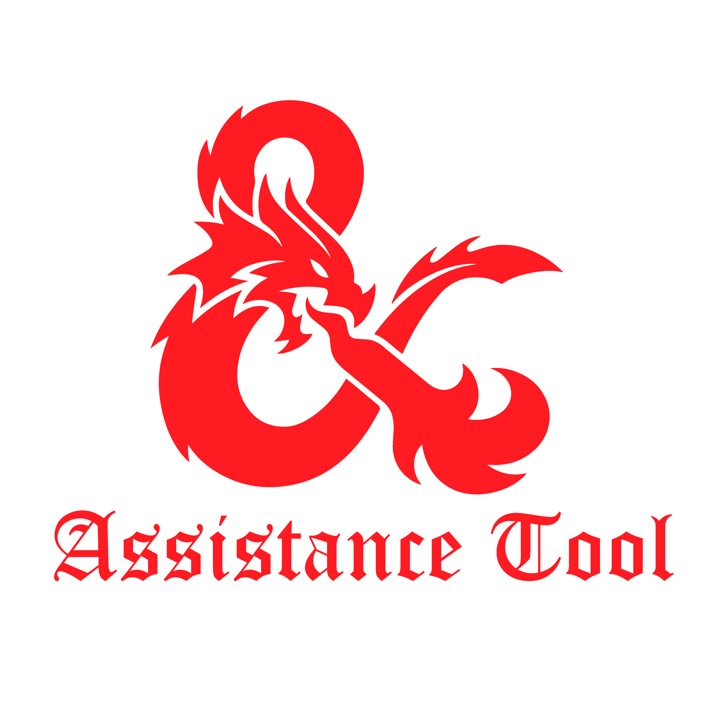
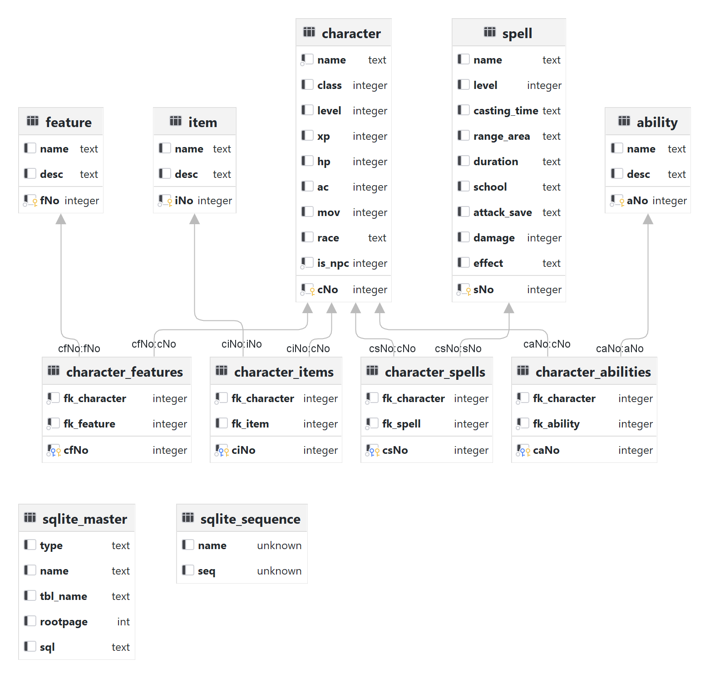

<p align="center"><br><br></p>

<h3 align="center">Dungeon & Dragons Assistance Tool</h3>
<p align="center"><strong><code>dnd5eassistancetool</code></strong></p>
<p align="center">Vue-Applikation zum unterstützten Leiten einer DnD-Kampange</p>
<br>
<p align="center">
  
  <a href="https://github.com/jepiqueau/vue-sqlite-app"></a>
  <a href="https://github.com/jepiqueau/vue-sqlite-app"></a>
<!-- ALL-CONTRIBUTORS-BADGE:START - Do not remove or modify this section -->
<a href="#contributors-"></a>
<!-- ALL-CONTRIBUTORS-BADGE:END -->
</p>

## Mitwirkende

| Mitwirkende  | GitHub                                                                                                                                                                                |
|--------------|---------------------------------------------------------------------------------------------------------------------------------------------------------------------------------------|
| Luke Grasser | <a href="https://github.com/zetsuboushii"><br/>[Zetsuboushii](https://github.com/zetsuboushii) |
| Nick Büttner | <a href="https://github.com/knick21"><br/>[Knick21](https:/github.com/knick21)                |


## Installation

Zu Beginn das Projekt klonen und folgende Befehle ausführen:
```bash
git clone https://github.com/zetsuboushii/dnd5eassistancetool.git 
cd dnd5eassistancetool
git remote rm origin
npm install
cd electron
npm install
npm run build
cd ..
```

## Ausführen der Applikation

```
npm run serve
```

## Dokumentation
### Inhalt
1. **Einleitung**
   1. Projektumfeld
   2. Projektbeschreibung
   3. Projektanforderungen
   4. Abgrenzung der Aufgabenbereiche
2. **Planung**
   1. Produktbeschreibung
   2. Projektphasen
3. **Analyse**
   1. Soll-Ist-Analyse
   2. Fachkonzept
4. **Entwurf**
   1. Zielplattform
      1. Technologien
      2. Datenbank
   2. Benutzeroberfläche
   3. Datenmodell

### 1 Einleitung
#### 1.1 Projektumfeld
Im Rahmen des Moduls "Projektmanagement II" des zweiten Semesters an der DHBW Mannheim
im Studiengang Angewandte Informatik, soll eine angenehm nutzbare Applikation in beliebig wählbarer
Technologie umgesetzt werden.

#### 1.2 Projektbeschreibung
Das Ziel dieses Projekts ist das Analysieren und Bearbeiten eines Problems in selbstorganisierter
Gruppenarbeit. Es wird daher von einer Struktur mit eng vorgegebenen Aufgaben abgewichen.
Ein wesentlicher Teil der Aufgabe ist daher die Prinzipien des Projektmanagements, wobei man sich mit der Beantwortung
folgender Fragen befassen sollte:
- Welches Ziel soll erreicht werden?
- Welche Schritte sind dazu notwendig?
- Wie werden diese auf die Projektteilnehmer verteilt?
- Wer überwacht in welcher Weise das Zusammenspiel der Teilprobleme?
- Erstellen einer Dokumentation

#### 1.3 Projektanforderungen
Das Projekt soll...
- eine Applikation in frei wählbarer Technologie sein.
- nach Fertigstellung eine Hilfestellung in gewissen Situationen geben.
- ein übersichtliches User-Interface (UI) besitzen.
- Einfachheit im Aufbau der Softwarearchitektur zur Erleichterung der Wartung besitzen.
- volle Basisfunktionalität besitzen
- **Fame** besitzen.

#### 1.4 Abgrenzung der Aufgabenbereiche
Die Gruppeneinteilung setzt sich grob folgendermaßen zusammen:

| Aufgabenbereich     | Austragende Person         |
|---------------------|----------------------------|
| Projektmanager      | Luke Grasser               |
| UI-Design           | Nick Büttner, Luke Grasser |
| Frontendentwicklung | Nick Büttner, Luke Grasser |
| Datenbankdesign     | Luke Grasser               |
| Datenbankintegrität | Luke Grasser               |
| Schriftführung      | Luke Grasser               |

Unabhängig von der Aufgabeneinteilung arbeiten alle Mitglieder des Projekts an allen Aufgaben
ganz nach Grundzügen des agilen Arbeiten an allen Aufgaben mit.
Die Besprechung der Aufgaben erfolgt ebenfalls mit allen Mitgliedern.

### 2 Planung
#### 2.1 Produktbeschreibung
Die Applikation stellt einen digitalen Assistent für den Kampagnenleiter (Dungeon Master, kurz DM)
des bekannten Tabletop-Rollenspiels [***Dungeons & Dragons***](https://dnd.wizards.com/de) dar.\
Der Anwender, beziehungsweise der DM, kann damit seine erstellten Non-Playable-Characters (NPCs), sowie 
Charaktere der Spieler mit all ihren Attributen und Eigenschaften verwalten.
Ebenfalls steht eine Datenbank zur Überschaubarkeit von erstellten Orten, Items und Monstern,
sowie ein Quest-Log zur Verfügung.
Zudem gibt es weitere Funktionalitäten für Würfelwürfe, Namensgeneratoren und Notizen, die den DM weiterhin unterstützen.

#### 2.2 Projektphasen
- Teambildung
- Auswahl des Themas
- Kurze Produktbeschreibung
- Auswahl des Vorgehensmodells
- Auswahl der Technologien
- Planung der Meilensteine

Das Projekt ist in verschiedene Meilensteine aufgeteilt.
Der erste Meilenstein beinhaltet alle Elemente, die zur Planung gehören. Darunter fallen Projektbeschreibung bzw.
Produktskizze, der erste Prototyp, Testfälle u.a.
Dieser Meilenstein soll bis zum 2. Termin realisiert werden.\
Der zweite Meilenstein beinhaltet die Entwurfsmodelle. Dazu gehören Prototypen u.a.
Dieser Meilenstein soll bis zum 6. Termin realisiert werden.\
Der dritte Meilenstein beinhaltet die Fachkonzepte. Darunter fällt die Applikation, die bis zur Meilenstein-Deadline
komplett implementiert sein soll.
Dieser Meilenstein soll bis zum 10. Termin realisiert werden.\
Der vierte und letzte Meilenstein widmet sich der Qualitätssicherung und der Finalisierung der Dokumentation.
Das Programm soll bis dahin vollständig funktionsfähig sein und eine finale Oberfläche besitzen.
Dieser Meilenstein soll bis zum letzten Termin realisiert werden.

### 3 Analyse
#### 3.1 Soll-Ist-Analyse
Das Erstellen und Durchführen einer DnD-Kampagne ist eine komplexe Aufgabe, die sehr schnell
durch viele Faktoren unübersichtlich werden kann. Das Wichtigste beim Leiten einer Kampagne ist die
Kontinuität der Welt und deren Charaktere.\
Hierbei erleichtert eine darauf angepasste Applikation diesen Vorgang, damit
kein Aspekt der Welt in Vergessenheit gerät.

#### 3.2 Fachkonzept
Den folgenden Kriterien *muss* die Applikation entsprechen:
- Ein UI ist vorhanden
- Eine Datenbank ist vorhanden und die Verbindung damit ist erfolgreich
- Charaktere, Quests, Items, Orte, Monster und Spells müssen in der Datenbank gespeichert und abgerufen werden können

Den folgenden Kriterien *kann* die Applikation entsprechen:
- Ein Pseudo-Zufallsgenerator für Würfel
- Namensgenerator für NPCs und Orte
- Bereich zum Speichern von Notizen

### 4 Entwurf
#### 4.1 Zielplattform
Die Applikation soll vorerst auf Windows und Unix-basierten Computersystemen laufen.
Zusätzlich sind Portierungen auf Android und iOS denkbar.
##### 4.1.1 Technologien
Die gewählte Technologie ist die Skriptsprache JavaScript in Kombination mit dem JavaScript Framework Vue.js.
JavaScript ist die weit verbreitetste Skriptsprache für dynamische Webanwendungen, wohingegen Vue mitsamt dem
Component Framework Vuetify eine einfache Möglichkeit Single-Page-Webanwendungen durch vorgefertigte Komponenten
zu bauen.\
Zudem sind webbasierte Anwendungen leicht auf andere Plattformen, wie Android und iOS zu porten.
##### 4.1.2 Datenbank
Datenbankseitig wird das relationale Datenbanksystem SQLite verwendet.
SQLite benötigt keine Server-Software und lässt sich dadurch direkt in entsprechende Anwendungen integrieren.
Da diese Applikation lokal auf dem Gerät des Nutzers laufen soll, bietet sich SQLite dafür perfekt an.\
Ebenfalls sind existieren in SQLite nur wenige vereinfachte Datentypen für die Tabellen.

#### 4.2 Benutzeroberfläche
Um dem Anwendungsfall gerecht zu werden, wurde sich für eine möglichst simple, grafische Oberfläche entschieden.
Ein konsistenter Navigation-Drawer ermöglicht das einfache Navigieren zwischen Subpages, dynamisch gerendert werden.

#### 4.3 Datenmodell


Die Entität "Character" ist die wohl komplexeste. Aus diesem Grund wird exemplarisch auf diese und
anhängende Entitäten eingegangen.\
Ein Charakter besitzt:
- einen Namen,
- eine Klasse,
- eine Klassenstufe,
- Erfahrungspunkte,
- Trefferpunkte,
- eine Rüstungsklasse,
- eine Bewegungsrate,
- eine Rasse,
- sowie eine Flag, ob ein Charakter ein NPC ist.

Zudem kann ein Charakter bis zu n
- Klassenattribute,
- Fähigkeiten,
- Items,
- und Zaubersprüche besitzen.
